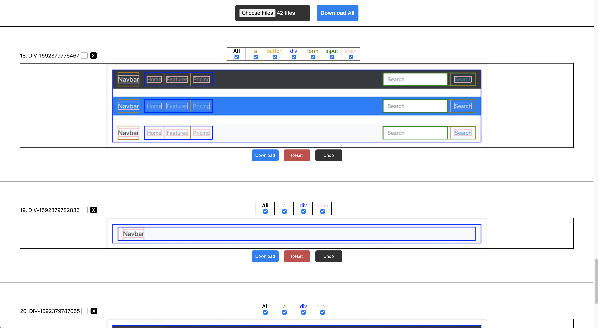
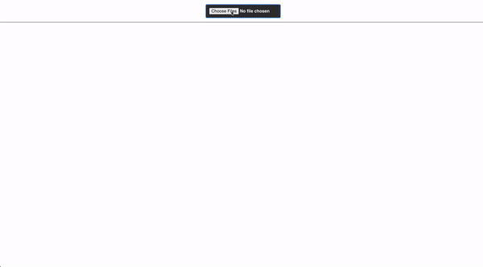

# Image2Html Labeling App

> Custom image labeling tool for [Darknet YOLO v2/v3/v4](https://github.com/AlexeyAB/darknet) neural network object detection (Bounding Boxes).

[]()
[]()
[]()
[]()
[]()
[]()
[]()
[]()

---
## Description

Online Labeling App - [Link](https://image2html-labeling-app.herokuapp.com/)

A React web app GUI tool to support create of an accurate data set for machine learning algorithm `Darknet YOLO Object Detection`. 
 
Allows viewing and editing bounding boxes on top of an image given a label file. 

* Upload label files with their matching image.
* Inspect, filter and remove wrong or unnecessary boxes and labels.
* Download the updated files
* Train your custom Object Detector model

---

[]()

---

[]()

---

## Installation

- Clone this repo
```shell
$ npm install
$ npm start
```

---

## FAQ

##### Why can't I draw new boxes?
In this version you can only delete boxes to optimize automatically prepared data

##### How should I create the label file?
This file should be prepared with labels in accordance with the requirements of darknet See: 
https://github.com/AlexeyAB/darknet